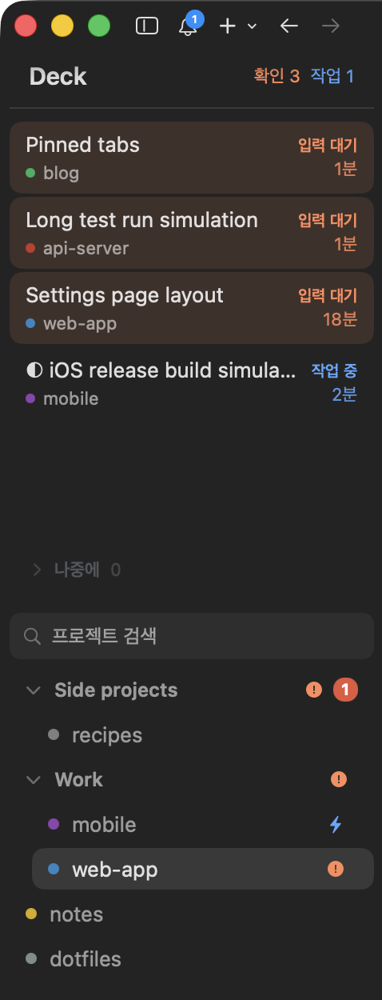

# Deck

A custom sidebar for [cmux](https://github.com/manaflow-ai/cmux) that turns the project list into a tab tree: search on top, your projects grouped below, and every tab of a project listed right under it.



If you run several Claude Code / Codex sessions per project, the tab bar stops being enough — you can't see what each tab is doing, or which one is waiting on you, without clicking through them. Deck lists them all in the sidebar, under the project they belong to, with a state dot on each row.

> The UI labels are in Korean for now. See [한국어](#한국어) below.

## Features

- **Tabs under each project.** Every open tab is a row under its project, in tab order, showing the tab title. The dot on the left is that tab's session state — orange: waiting for input, blue: working, green: just finished, grey: nothing running — and the time on the right is how long it has been in that state. Click a row to jump straight to that tab.
- **Click a project to fold its tabs.** A project row doesn't open the project — it folds its tabs away and shows the tab count instead, the same as a group header. Jumping is what the tab rows are for. To open a project directly (say, one with no tabs), right-click → *이 프로젝트 열기*. *탭 접기* / *탭 펼치기* on the right of the sort row folds or unfolds every project at once.
- **Groups read as sections.** A thin rule and a small bold name, no indent — so the project and tab names below get the full width. A collapsed group shows its project count, the most urgent state inside it, and the unread total.
- **Project list.** The built-in grouping by default, with collapse and pin order, or recent-activity order. Each project shows a state icon (⚡ working, ! waiting, ✓ done) and the unread badge.
- **Drag between groups, recolor.** In the *그룹* view, drag a project into, out of, or between groups (drag a group header to move the whole group). Right-click a project to change its color or send it to a group (a flat menu, since submenus are not rendered yet). A project that joins a group takes that group's color (the color most of its members use). Right-click a group header to paint the whole group at once.
- **Search and sort.** Filter projects by name as you type (Enter jumps to the first match), and switch the list between *그룹* (the built-in grouping) and *최근순* (most recently active first, groups ignored).

## Install

Requires a cmux build with custom sidebars (the `.js` runtime).

```sh
git clone https://github.com/code918/cmux-deck.git
cd cmux-deck
./install.sh
```

Then right-click the sidebar toggle button in cmux and pick **deck**, or run:

```sh
cmux sidebar select deck
```

`install.sh` symlinks `deck.js` into `~/.config/cmux/sidebars/`, so `git pull` updates the sidebar in place. If you'd rather not use a symlink, copy `deck.js` there yourself.

To go back to the built-in sidebar, right-click the sidebar toggle button and pick the default.

## Configuration

Edit the constants at the top of `deck.js`. cmux hot-reloads the file on save.

| Constant | Default | Meaning |
| --- | --- | --- |
| `FRESH` | `180` | Seconds a finished session keeps its green "done" dot |
| `STALE` | `3600` | Seconds a "waiting for input" signal counts as urgent. Past this the tab goes quiet — see below |
| `TONE` | | Colors for each state |

## Versions and updating

The running version is `VERSION` in `deck.js` (it isn't shown in the sidebar). Changes are listed in [CHANGELOG.md](CHANGELOG.md), and each version is tagged (`v0.3.0`).

`install.sh` links the file instead of copying it, so updating is just:

```sh
git pull && cmux sidebar reload deck
```

## Limitations

- **No approve / deny buttons.** The sidebar data doesn't expose permission request IDs. Use cmux's Feed panel (`Ctrl-4`) or the notification buttons for that.
- **"Waiting for input" is broad, and it never expires on its own.** Claude Code sends that signal about a minute after it finishes and leaves it on, and cmux doesn't count `/clear` as activity — so without help, every tab left open overnight comes back orange with yesterday's timestamp. Deck treats the signal as urgent only while it is fresh (`STALE`, one hour by default) and lets older ones go quiet. The trade-off: a question you left unanswered all day stops standing out.
- **Collapsed tab lists are not remembered.** Custom sidebars have no storage, so every project starts expanded after a cmux restart.
- No rename in the project list, and drag only works in the *그룹* view. Switch to the built-in sidebar for the rest.
- **Group headers don't open the group's own terminal.** Closing that terminal deletes the whole group in cmux, so Deck keeps it out of reach: a header click only collapses or expands. The group terminal's own tabs are not listed either.

## License

GPL-3.0-or-later. See [LICENSE](LICENSE).

The group list and collapse logic is based on the official cmux example `Examples/CustomSidebars/workspaces.js` (GPL-3.0-or-later, Copyright (c) Manaflow, Inc.).

---

## 한국어

cmux 왼쪽 사이드바를 **프로젝트 + 탭 목록**으로 바꿔주는 커스텀 사이드바예요. 탭을 많이 열어두면 탭 바만 봐서는 뭐가 뭔지 모르는데, 프로젝트 아래에 그 프로젝트의 탭을 쭉 펼쳐서 한눈에 고를 수 있게 해줘요.

- **프로젝트 아래에 탭**: 열려 있는 탭을 순서대로 한 줄씩. 왼쪽 점이 그 탭의 상태(주황=입력 대기, 파랑=작업 중, 초록=방금 끝남, 회색=조용함)고, 오른쪽은 그 상태로 있은 시간. 누르면 그 탭으로 바로 이동해요. 사이드바가 좁아도 이름이 살도록 들여쓰기는 최소로 주고, 경로가 제목인 탭은 폴더 이름만 보여줘요.
- **프로젝트를 누르면 탭이 접혀요**: 프로젝트 줄은 그 프로젝트로 넘어가지 않고 탭 목록만 접었다 펴요(그룹 머리글과 같은 규칙). 이동은 탭 줄로 해요. 프로젝트를 바로 열고 싶으면 우클릭 → *이 프로젝트 열기*. 정렬 줄 오른쪽 *탭 접기* / *탭 펼치기* 로 전체를 한 번에.
- **그룹은 구역으로**: 얇은 선과 작은 이름만 두고 들여쓰기를 안 써요. 그만큼 아래 프로젝트·탭 이름이 폭을 다 써요. 접으면 그룹 안 프로젝트 수와 가장 급한 상태, 안 읽은 수를 머리글에 모아 보여줘요.
- **프로젝트 목록**: 기본은 그룹 보기, 최근 작업순으로도 전환 가능. 상태 아이콘과 안 읽은 알림 수.
- **끌어서 그룹 이동·색상 변경**: 그룹 보기에서 프로젝트를 끌어 그룹 안팎으로 옮겨요(그룹 머리글을 끌면 그룹째 이동). 프로젝트를 우클릭하면 색상 변경과 그룹 이동 메뉴가 나와요. 그룹에 들어간 프로젝트는 그 그룹 색(멤버들이 가장 많이 쓰는 색)으로 자동으로 바뀌어요. 그룹 머리글을 우클릭하면 그룹 전체 색을 한 번에 바꿔요.
- **검색·정렬**: 이름으로 바로 거르기(Enter로 첫 결과 이동). 목록을 그룹 보기와 최근순으로 전환.

바뀐 내용은 [CHANGELOG.md](CHANGELOG.md), 업데이트는 `git pull && cmux sidebar reload deck`.

설치는 `./install.sh` 후 사이드바 버튼 우클릭 → **deck**.
