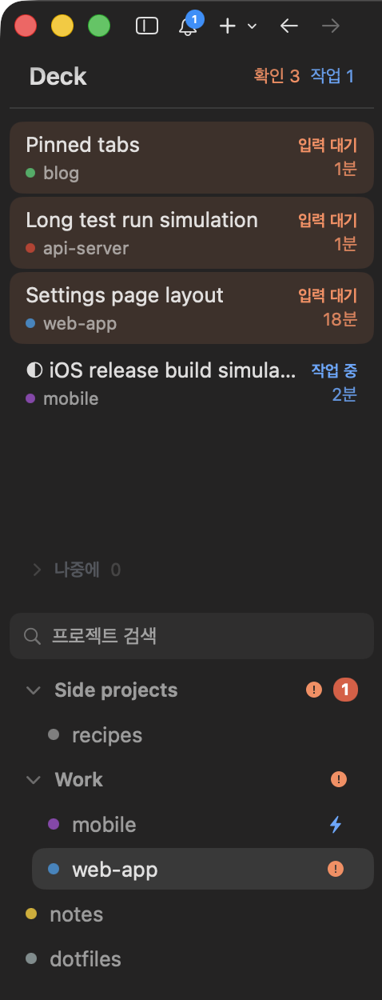

# Deck

A custom sidebar for [cmux](https://github.com/manaflow-ai/cmux) that turns the project list into a tab tree: search on top, your projects grouped below, and every tab of a project listed right under it.



If you run several Claude Code / Codex sessions per project, the tab bar stops being enough — you can't see what each tab is doing, or which one is waiting on you, without clicking through them. Deck lists them all in the sidebar, under the project they belong to, with a state dot on each row.

> The UI labels are in Korean for now. See [한국어](#한국어) below.

## Features

- **Tabs under each project.** Every open tab is a row under its project, in tab order, showing the tab title. The dot on the left is that tab's session state — orange: waiting for input, blue: working, green: just finished, grey: nothing running — and the time on the right is how long it has been in that state. Click a row to jump straight to that tab.
- **Add a tab to any project, from the keyboard.** The **+** in the sort row turns the list into a project picker with the cursor already in the search box: type a few letters, press Enter, and a Claude terminal opens at the end of that project's tabs, focused. Right-click the **+** for a plain shell instead. Enter on an empty box takes the top row, which is the project you were last in. Hovering a project row also turns its chevron into a **+**, which opens the same kind of tab in that project straight away. Right-click any **+**, project row, picker row or tab row to pick the other kind instead.
- **Click a project to fold its tabs.** A project row doesn't open the project — it folds its tabs away and shows the tab count instead, the same as a group header. Jumping is what the tab rows are for. To open a project directly (say, one with no tabs), right-click → *이 프로젝트 열기*. *탭 접기* / *탭 펼치기* on the right of the sort row folds or unfolds every project at once.
- **Groups read as sections.** A thin rule and a small bold name, no indent — so the project and tab names below get the full width. A collapsed group shows its project count, the most urgent state inside it, and the unread total.
- **Project list.** The built-in grouping by default, with collapse and pin order, or recent-activity order. Each project shows a state icon (⚡ working, ! waiting, ✓ done) and the unread badge.
- **Drag between groups, recolor.** In the *그룹* view, drag a project into, out of, or between groups (drag a group header to move the whole group). Right-click a project to change its color or send it to a group (a flat menu, since submenus are not rendered yet). A project that joins a group takes that group's color (the color most of its members use). Right-click a group header to paint the whole group at once, or *그룹 이름 바꾸기* to rename it in place. Right-click a project → *새 그룹으로 묶기* starts a new group with that project in it.
- **One search for projects and tabs.** Typing matches project names *and* tab titles at once, in either view, and the results come back as one list: each matching project with its tabs under it, then the tabs whose titles matched elsewhere, each naming its project. Enter takes the top row — opening it if it is a project, jumping to it if it is a tab. Search ignores age, so a tab quiet for a week still shows up. It also survives the wrong keyboard layout: `정미들다` finds a project called `dnsauemfek`'s Korean name and `dnsau` finds `운며들다`, because both sides are compared as the keys you pressed.
- **Put a row down with X.** Hover a row in *최근순* and the state column turns into an **X**. It doesn't close the tab — it marks the row as seen, so it leaves *최근순* and its dot goes quiet until that tab moves again. Use it on rows you are done with — a session you `/clear`ed, say, which keeps its old title and its "just finished" time and sits at the top looking like news. Deck no longer tries to guess which sessions are empty; that guess kept hiding tabs that were still in use. Right-click has *탭 닫기* for when you did mean to close it. Not remembered across a cmux restart — custom sidebars have no storage.
- **_세션_: what is running.** The third view lists every tab whose Claude session is open right now, most recently active first. Exited sessions drop out; so do the empty records cmux revives after a restart. If a crashed session still lingers, run `python3 scripts/end-dead-sessions.py` to have cmux mark it ended.
- **_최근순_: just the tabs, newest first.** The other view drops projects and groups entirely and lists tabs touched in the last 30 days (`RECENT`), most recent first. Grouping by project doesn't work here: one busy project drags all of its quiet tabs up with it, and a project with 17 tabs buries everything else.

## Install

Requires a cmux build with custom sidebars (the `.js` runtime).

```sh
git clone https://github.com/code918/cmux-deck.git
cd cmux-deck
./install.sh
```

Then right-click the sidebar toggle button in cmux and pick **deck**, or run:

```sh
cmux sidebar select deck
```

`install.sh` symlinks `deck.js` into `~/.config/cmux/sidebars/`, so `git pull` updates the sidebar in place. If you'd rather not use a symlink, copy `deck.js` there yourself.

To go back to the built-in sidebar, right-click the sidebar toggle button and pick the default.

## Configuration

Edit the constants at the top of `deck.js`. cmux hot-reloads the file on save.

| Constant | Default | Meaning |
| --- | --- | --- |
| `FRESH` | `180` | Seconds a finished session keeps its green "done" dot |
| `STALE` | `3600` | Seconds a "waiting for input" signal counts as urgent. Past this the tab goes quiet — see below |
| `RECENT` | `2592000` (30일) | Seconds a tab stays listed in *최근순*. Search is not affected |
| `PLUS_TAB` | `1` | Which `NEW_TABS` entry a **+** click opens; the rest are in its right-click menu |
| `NEW_TABS` | `null` / `cl` / `cdx` | What the new-tab menu offers: a label and the command typed into the new terminal (`null` for a plain shell). It is typed into your own interactive shell, so aliases and functions work. `cl` and `cdx` are the author's aliases for `claude` and `codex`; if your shell has no such alias, the tab just runs plain `claude` / `codex`. Change it to whatever starts yours |
| `TONE` | | Colors for each state |

## Versions and updating

The running version is `VERSION` in `deck.js` (it isn't shown in the sidebar). Changes are listed in [CHANGELOG.md](CHANGELOG.md), and each version is tagged (`v0.3.0`).

`install.sh` links the file instead of copying it, so updating is just:

```sh
git pull && cmux sidebar reload deck
```

## Limitations

- **No approve / deny buttons.** The sidebar data doesn't expose permission request IDs. Use cmux's Feed panel (`Ctrl-4`) or the notification buttons for that.
- **"Waiting for input" is broad, and it never expires on its own.** Claude Code sends that signal about a minute after it finishes and leaves it on, and cmux doesn't count `/clear` as activity — so without help, every tab left open overnight comes back orange with yesterday's timestamp. Deck treats the signal as urgent only while it is fresh (`STALE`, one hour by default) and lets older ones go quiet. The trade-off: a question you left unanswered all day stops standing out.
- **Collapsed tab lists are not remembered.** Custom sidebars have no storage, so every project starts expanded after a cmux restart.
- No project rename (groups can be renamed), and drag only works in the *그룹* view. Switch to the built-in sidebar for the rest.
- **Group headers don't open the group's own terminal.** Closing that terminal deletes the whole group in cmux, so Deck keeps it out of reach: a header click only collapses or expands. The group terminal's own tabs are not listed either.

## License

GPL-3.0-or-later. See [LICENSE](LICENSE).

The group list and collapse logic is based on the official cmux example `Examples/CustomSidebars/workspaces.js` (GPL-3.0-or-later, Copyright (c) Manaflow, Inc.).

---

## 한국어

cmux 왼쪽 사이드바를 **프로젝트 + 탭 목록**으로 바꿔주는 커스텀 사이드바예요. 탭을 많이 열어두면 탭 바만 봐서는 뭐가 뭔지 모르는데, 프로젝트 아래에 그 프로젝트의 탭을 쭉 펼쳐서 한눈에 고를 수 있게 해줘요.

- **프로젝트 아래에 탭**: 열려 있는 탭을 순서대로 한 줄씩. 왼쪽 점이 그 탭의 상태(주황=입력 대기, 파랑=작업 중, 초록=방금 끝남, 회색=조용함)고, 오른쪽은 그 상태로 있은 시간. 누르면 그 탭으로 바로 이동해요. 사이드바가 좁아도 이름이 살도록 들여쓰기는 최소로 주고, 경로가 제목인 탭은 폴더 이름만 보여줘요.
- **탭 추가**: 정렬 줄의 **+** 를 누르면 목록이 "어느 프로젝트에 넣을까" 고르는 화면으로 바뀌고 검색칸에 커서가 들어가요. 기본은 Claude 터미널이고, 빈 터미널은 **+** 를 우클릭해서 고르면 돼요. 몇 글자 치고 Enter(또는 줄 클릭)면 그 프로젝트 **맨 뒤**에 터미널 탭이 생기고 바로 그 탭으로 넘어가요. 빈 칸에서 Enter 면 맨 위 = 방금까지 쓰던 프로젝트. **+** 를 다시 누르거나 Esc 로 빠져나와요. 프로젝트 줄에 마우스를 올려도 화살표 자리가 **+** 로 바뀌어요. 이미 눈에 보이는 프로젝트면 그걸 누르면 바로 열려요. 종류를 바꾸려면 우클릭 — **+**·프로젝트 줄·고르기 줄·탭 줄 어디서든 나와요. 메뉴에 올릴 명령은 `deck.js` 위쪽 `NEW_TABS` 에서 바꿔요.
- **프로젝트를 누르면 탭이 접혀요**: 프로젝트 줄은 그 프로젝트로 넘어가지 않고 탭 목록만 접었다 펴요(그룹 머리글과 같은 규칙). 이동은 탭 줄로 해요. 프로젝트를 바로 열고 싶으면 우클릭 → *이 프로젝트 열기*. 정렬 줄 오른쪽 *탭 접기* / *탭 펼치기* 로 전체를 한 번에.
- **그룹은 구역으로**: 얇은 선과 작은 이름만 두고 들여쓰기를 안 써요. 그만큼 아래 프로젝트·탭 이름이 폭을 다 써요. 접으면 그룹 안 프로젝트 수와 가장 급한 상태, 안 읽은 수를 머리글에 모아 보여줘요.
- **프로젝트 목록**: 기본은 그룹 보기, 최근 작업순으로도 전환 가능. 상태 아이콘과 안 읽은 알림 수.
- **끌어서 그룹 이동·색상 변경**: 그룹 보기에서 프로젝트를 끌어 그룹 안팎으로 옮겨요(그룹 머리글을 끌면 그룹째 이동). 프로젝트를 우클릭하면 색상 변경과 그룹 이동 메뉴가 나와요. 그룹에 들어간 프로젝트는 그 그룹 색(멤버들이 가장 많이 쓰는 색)으로 자동으로 바뀌어요. 그룹 머리글을 우클릭하면 그룹 전체 색을 한 번에 바꾸거나 *그룹 이름 바꾸기* 로 이름을 고쳐요. 프로젝트 우클릭 → *새 그룹으로 묶기* 하면 그 프로젝트가 든 새 그룹이 생겨요.
- **검색은 하나로**: 프로젝트 이름과 탭 제목을 같이 찾고 결과도 한 목록이에요. 이름이 맞은 프로젝트는 그 밑에 탭까지 같이, 제목이 맞은 탭은 어느 프로젝트인지 적힌 줄로 뒤에 붙어요. 어느 보기에 있든 같은 결과가 나오고, Enter는 맨 윗줄 — 프로젝트면 열고 탭이면 그리로 이동해요. 오래 조용한 탭도 검색엔 나와요. 한/영을 잘못 치고 검색해도 찾아줘요 — `해ㅔㅅㄷ` 로 쌀 gopte 가, `dnsau` 로 쌀 운며들다 가 나와요. 양쪽을 두벌식 자판에서 누른 키로 펴서 비교해요.
- **X로 내려놓기**: *최근순* 줄에 마우스를 올리면 오른쪽 상태 자리가 **X** 로 바뀌어요. 탭을 닫는 게 아니라 "봤다" 표시라, 그 줄은 최근순에서 빠지고 점도 가라앉아요. 그 탭이 다시 움직이면 알아서 돌아오고요. `/clear` 한 세션처럼 다 본 줄에 쓰면 돼요. 예전엔 그런 줄을 제목으로 알아맞혀 숨겼는데, 멀쩡히 쓰는 탭까지 같이 숨어서 없앴어요. 정말 닫고 싶으면 우클릭 → *탭 닫기*. 사이드바엔 저장소가 없어서 cmux 를 껐다 켜면 풀려요.
- **세션 보기**: 지금 Claude 가 켜져 있는 탭만 최근 순으로 보여줘요. 끝난 세션과 cmux 가 재시작 때 되살려 둔 빈 기록은 빠져요. Claude 가 비정상 종료돼서 남아 있으면 `python3 scripts/end-dead-sessions.py` 로 정리해요.
- **최근순은 탭만**: 프로젝트·그룹 묶음을 아예 버리고, 30일 안에 움직인 탭만 최근 순으로 쭉 보여줘요. 프로젝트로 묶으면 바쁜 프로젝트 하나가 자기 조용한 탭까지 다 끌고 올라와서 나머지가 묻혀요.

바뀐 내용은 [CHANGELOG.md](CHANGELOG.md), 업데이트는 `git pull && cmux sidebar reload deck`.

설치는 `./install.sh` 후 사이드바 버튼 우클릭 → **deck**.
